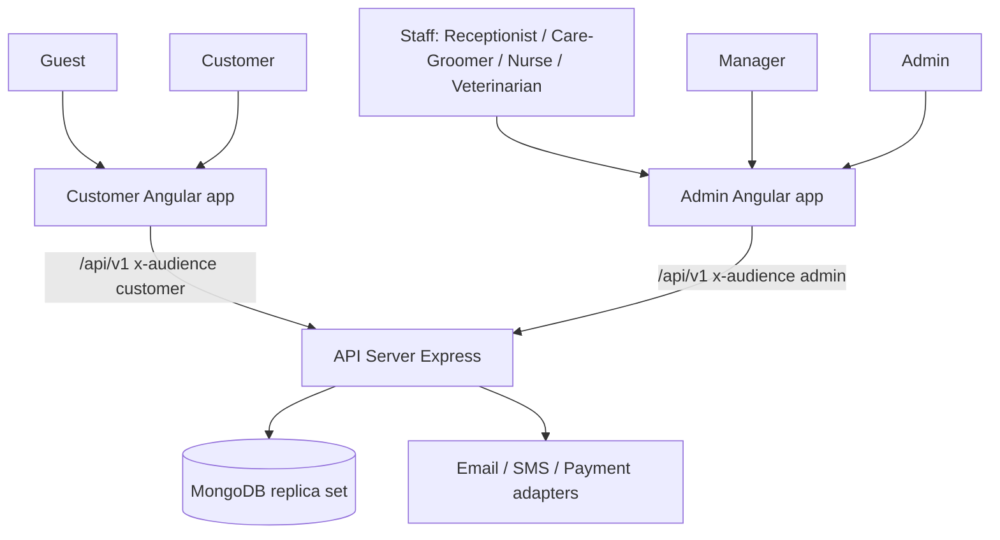
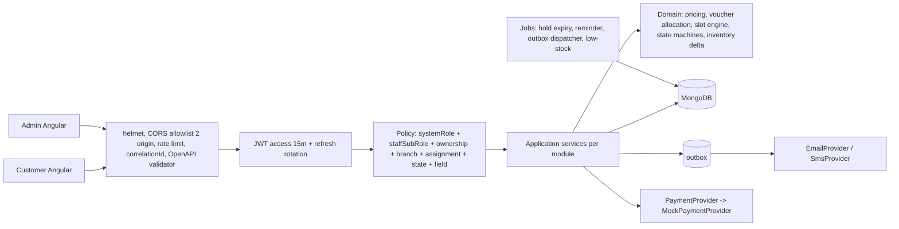

# 03 Target System Architecture v5 (Greenfield, 2 Angular apps, scope lock)

Node.js + Express + MongoDB (replica set). Modular monolith. OpenAPI-first `/api/v1`.

## Context

## Container

## Hop dong FE: mot OpenAPI, hai Angular
- `07-openapi-v5.yaml` la nguon duy nhat. Moi operation co `x-audience` (customer, admin, hoac ca hai) de sinh hai goi: `api-customer` va `api-admin` (openapi-generator `typescript-angular` hoac `ng-openapi-gen`) hoac mot goi chung co tag.
- Customer app khong duoc goi operation chi co audience admin (kiem tra CI).
- Admin Angular IA theo sheet task 2.4: Dashboard; User Management/Customers; Sales/Product/Order/Refund; Service/Branch/Appointment/Service Records; Inventory; Staff/Role/Shift; Voucher; Feedback/Review; Content.
- Loi theo Problem Details; hanh dong hien thi theo `allowedActions[]` do server tra.

## Modules
| Module | Collections |
|---|---|
| identity | users, otp_challenges, refresh_sessions |
| customer | customers, guest_contacts |
| pet | pets |
| branch | branches |
| serviceCatalog (ADMIN) | services |
| branchService (MANAGER trong assignedBranches) | branch_service_configs |
| staff, shift | staff_profiles, shifts |
| catalog (ADMIN) | categories, products |
| cart | carts |
| order | orders, order_returns, order_refunds |
| voucher | vouchers, voucher_usages |
| booking | appointments, slot_reservations, appointment_requests |
| serviceExecution | service_records, service_record_revisions |
| inventory | inventory_items, inventory_stocks, inventory_transactions (append-only) |
| payment, refund | payments, booking_refunds |
| settings | system_settings |
| notification | notifications, outbox |
| audit | audit_logs, idempotency_keys |
| review | reviews |

## Transaction Boundary Matrix
Single-document la atomic, khong dung transaction. Multi-document dung tx (can replica set).
| Boundary | Tx? | Noi dung | Idempotency |
|---|---|---|---|
| **Checkout** | Co | resolver chon branch, roi tai branch do: Order PENDING (snapshot line, phan bo discount) + N ledger ISSUE + N conditional stock decrement + voucher quota consume + Payment PENDING (1 tx) | Idempotency-Key; unique ledger (ORDER, orderId, item, ISSUE) |
| **Payment failure/cancel/expire (ONLINE_MOCK)** | Co | Payment terminal + Order CANCELLED + N ledger RECEIPT + restore voucher (compensating tx) | callback lap lai = no-op; unique ledger (ORDER, orderId, item, RECEIPT); unique voucher_usages |
| **Order cancel** | Co | status + N ledger RECEIPT hoan ton + voucher restore + payment/refund | key |
| Order transition (confirm, process, ship, deliver) | Khong (1 doc, conditional update status) | orders | tu nhien |
| Order return create | Co | order_returns + conditional `returnReservedQty` tren orders | key |
| Return receive (PROCESSING > RECEIVED) | Khong (1 doc, conditional status) | order_returns | tu nhien |
| Return approve (RECEIVED > APPROVED) | Co | order_returns + order_refunds PENDING | key |
| Order refund process | Co | order_refunds + payments (refundedAmount, status) + order_returns COMPLETED | key |
| Booking | Co | slot_reservations (N unit) + appointment + snapshots + voucher consume | key + unique reservation |
| Deposit / balance payment (mock) | Co | payments + appointments.deposit | key + providerRef unique |
| Booking refund | Co | booking_refunds + payments + deposit | key + 1 refund mo/payment |
| Service finalize | Co | revision + ledger delta + stocks + appointment | key + unique (record, version, item) |
| Inventory receive/issue/adjust | Co | 1 ledger + 1 stock | key |
| Inventory transfer | Co | 2 ledger + 2 stocks | key |
| Shift create | Co | overlap check + insert | retry WriteConflict |
| Branch service config / manager assignment | Khong | 1 doc, version | -- |

## Booking: tu dat va dat ho
`appointmentsCreate` (Customer/Guest tu dat) va `internalAppointmentsCreate` (Receptionist/Manager/Admin dat ho Customer hoac Guest) dung chung use case domain, khac request schema va authorization. Guest khong co account/mat khau.

## Availability engine (booking)
Branch + openingHours + holidays + slotLocks + BranchServiceConfig(enabled, capacity, availability) cho moi service chon + tong durationMinutes + cung requiredStaffRole + Staff.authorizedBranchIds + Shift(branchId) + slot_reservations hien co. Computed, khong luu. Reservation luu khi tao appointment. Moi service chon phai cung serviceType, requiredStaffRole, bookingMode.

## Providers
`PaymentProvider{createCharge, refund}` -> `MockPaymentProvider`. Email/SMS qua outbox; nhac lich qua email + notification (chuong). OTP: CSPRNG, hash, TTL 5 phut, 5 lan, resend 30s.

## Assumptions: xem 16. Khong con open decision. `FulfillmentBranchResolver` = `PriorityListResolver`: duyet `system_settings.fulfillmentBranchPriority`, chon branch ACTIVE dau tien du ton cho toan bo cart, ISSUE tai branch do (xem 04).
