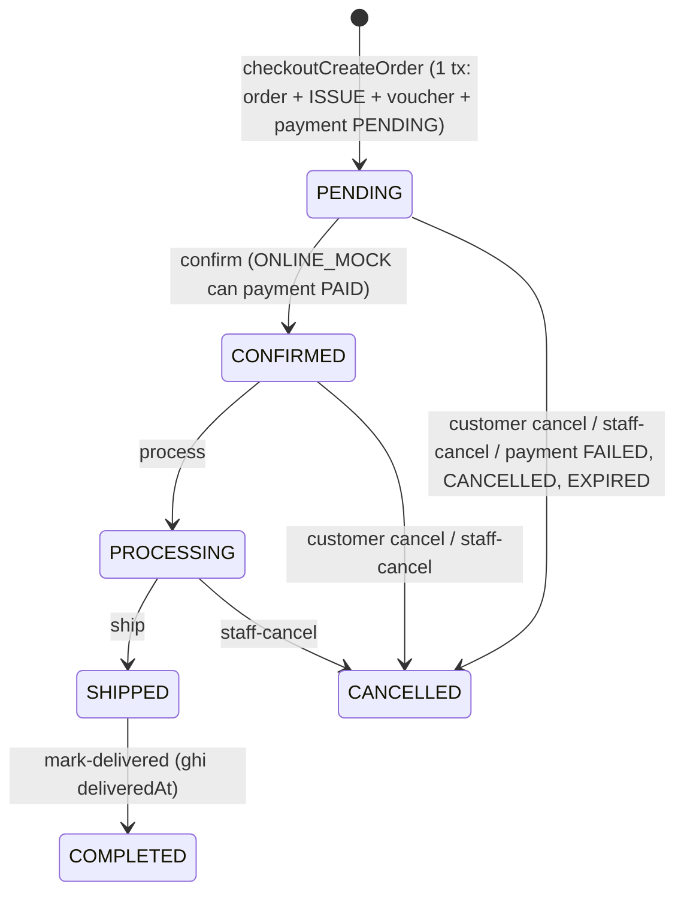
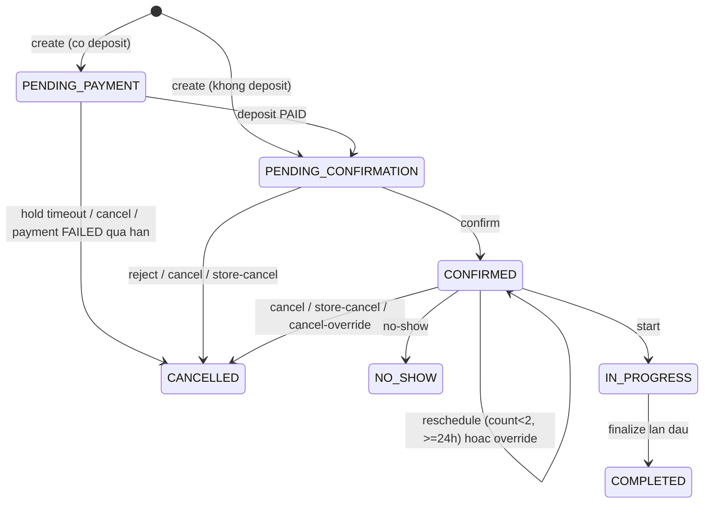
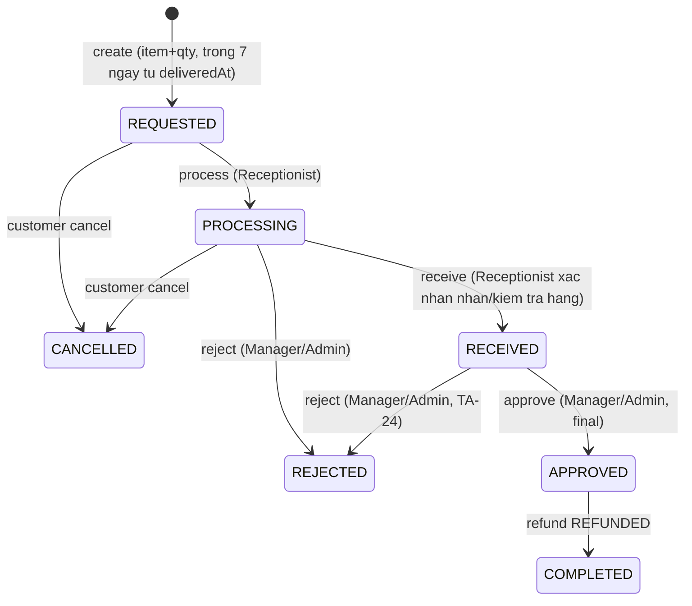

# 09 State Machines v5

Moi transition la action endpoint; audit; actor/role do server suy ra.

## 9.1 Activation: NO_ACCOUNT > PENDING_ACTIVATION (activationInviteSend) > ACTIVATED (activationComplete: OTP + password 8+ ky tu co chu hoa va so + acceptTerms). Cam tu sinh password.
## 9.2 AccountStatus (feedback 5)
ACTIVE --block--> BLOCKED; BLOCKED --unblock--> ACTIVE. **Chi ADMIN**, reason bat buoc, audit, revoke refresh. Manager khong co transition nay (403). BLOCKED chi chan login, khong chan hay xoa lich su giao dich.

## 9.3 Order (M08, BF02)

| From | Action | Actor | Pre | To | Side effects |
|---|---|---|---|---|---|
| (new) | checkoutCreateOrder | Customer/Guest | cart hop le, product ACTIVE, ton du, voucher hop le | PENDING | 1 tx: Order + pricing + consume voucher + ISSUE ledger + conditional stock decrement + Payment PENDING. `fulfillmentBranchId` do FulfillmentBranchResolver gan (branch ACTIVE dau tien trong fulfillmentBranchPriority du ton cho toan bo cart); khong du => INSUFFICIENT_INVENTORY |
| PENDING | ordersConfirm | Receptionist/Manager/Admin | ONLINE_MOCK: payment PAID; COD: khong can | CONFIRMED | notification |
| CONFIRMED | ordersProcess | nt | -- | PROCESSING | -- |
| PROCESSING | ordersShip | nt | -- | SHIPPED | carrier/tracking |
| SHIPPED | ordersMarkDelivered | nt | -- | COMPLETED | `deliveredAt = now`; COD payment PAID; mo cua so tra 7 ngay |
| PENDING/CONFIRMED | ordersCancel | Customer/Guest | OWN | CANCELLED | compensating tx (xem duoi) |
| PENDING/CONFIRMED/PROCESSING | ordersStaffCancel | Receptionist/Manager/Admin | reason | CANCELLED | compensating tx |
| PENDING | (payment FAILED/CANCELLED/EXPIRED) | system | payment ONLINE_MOCK terminal | CANCELLED | compensating tx |
**Compensating transaction (1 tx, idempotent)**: Order CANCELLED; moi dong ISSUE duoc doi ung bang RECEIPT (sourceType ORDER, unique (ORDER, orderId, item, RECEIPT) => khong hoan 2 lan); restore voucher quota (unique voucher_usages); payment o terminal state. Neu payment da PAID: payment REFUND_PENDING + OrderRefund cause CANCELLATION.
Cam: huy khi SHIPPED/COMPLETED; hard delete; client set status. Khong co retry thanh toan, khong queue, khong doi soat.

## 9.4 Payment (mock)
PENDING --PAID (mock complete / record-at-store / COD luc giao)--> PAID. PENDING --FAILED (mock callback)--> FAILED. PENDING --paymentsCancel--> CANCELLED. PENDING --timeout job (ONLINE_MOCK)--> EXPIRED. FAILED/CANCELLED/EXPIRED la terminal (khong tai su dung; tao thanh toan moi la luong ngoai scope hien tai). PAID --refund--> REFUND_PENDING --> REFUNDED (hoan het) hoac PAID (hoan mot phan, `refundedAmount` cong don).
Method: Appointment: ONLINE_MOCK, PAY_AT_STORE. Order: ONLINE_MOCK, COD. Target: ORDER | APPOINTMENT. Kind: DEPOSIT, BALANCE, ORDER.
Callback lap lai (failure/cancel/expire): no-op, tra trang thai hien tai, khong ghi ledger 2 lan. Timeout: thoi han la cau hinh ky thuat.
Cam: PAID > PENDING; terminal failure > PAID.

## 9.5 Appointment

Create (tu dat) chi luu DB khi khach bam "Dat lich" cuoi (Log); dat ho: internalAppointmentsCreate (Receptionist/Manager/Admin, customerId XOR contact). Tat ca service cung serviceType, cung requiredStaffRole, cung bookingMode (errors MIXED_SERVICE_TYPES, INCOMPATIBLE_STAFF_ROLES + suggestedGroups, BOOKING_MODE_NOT_ALLOWED, SERVICE_NOT_ENABLED_AT_BRANCH, SLOT_UNAVAILABLE).
Reschedule customer: >=24h, toi da 2 lan; override Manager/Admin co reason. Cancel customer: >=24h hoan 100% coc; <24h FORFEITED (server tinh). Store-cancel: REFUNDED 100% hoac TRANSFERRED. No-show: coc FORFEITED, grace 15 phut (TA-04); khong co rule dem no-show de bat coc (xem 16). Start: assigned Care/Nurse/Vet tao service_record.

## 9.6 Deposit
NOT_REQUIRED (service khong bat coc). PENDING > HELD (payment PAID) > APPLIED (COMPLETED, tru vao tong) | REFUNDED | FORFEITED | TRANSFERRED. Deposit = 30% finalAmount (sau voucher) cho toan Appointment khi co service bat coc. FORFEITED > REFUNDED chi qua ngoai le `bookingRefundOverride` cua Manager/Admin co reason (khong lien quan cau hinh deposit).
## 9.7 Booking Refund: REQUESTED > PROCESSING (Receptionist/Manager/Admin) > APPROVED (Manager/Admin) > REFUNDED (mock) | REJECTED. Receptionist khong approve.

## 9.8 OrderReturn (M09)

| From | Action | Actor | Pre | To | Side |
|---|---|---|---|---|---|
| (new) | orderReturnCreate | Customer/Guest | order COMPLETED co deliveredAt, now <= deliveredAt + 7d, 0 < qty <= returnableQty | REQUESTED | tinh san refund (phan thuc tra sau discount); giu `returnReservedQty` |
| REQUESTED | orderReturnProcess | Receptionist | kiem tra ly do/bang chung | PROCESSING | -- |
| PROCESSING | orderReturnReceive | Receptionist | -- | RECEIVED | khong refund, khong doi ton kho |
| RECEIVED | orderReturnApprove | Manager/Admin | hang da nhan | APPROVED | dong bang refundBreakdown; tao OrderRefund PENDING |
| PROCESSING/RECEIVED | orderReturnReject | Manager/Admin | reason | REJECTED | tra lai returnReservedQty. **Tu RECEIVED: khong refund, khong nhap stock, khong tao OrderRefund; hang tra lai Customer xu ly thu cong/out-of-system** |
| REQUESTED/PROCESSING | orderReturnCancel | Customer | -- | CANCELLED | tra lai returnReservedQty |
`APPROVED` = final approve sau khi hang da duoc nhan, khong phai "cho phep gui hang ve". Receptionist khong approve/reject. Loi: RETURN_WINDOW_EXPIRED, RETURN_QTY_EXCEEDS_RETURNABLE, INVALID_STATE_TRANSITION.
## 9.9 OrderRefund
PENDING --process (Manager/Admin, mock)--> REFUNDED (OrderReturn APPROVED > COMPLETED; payment.refundedAmount cong don) | FAILED (thu lai voi key moi). Amount = refundBreakdown.total, khong sua duoc. Cause CANCELLATION: orderReturnId null.

## 9.10 ServiceRecord
MEDICAL: DRAFT > IN_PROGRESS > WAITING_VET_REVIEW (Nurse submit) > FINALIZED (chi Veterinarian). GROOMING: IN_PROGRESS > FINALIZED (Care Staff). FINALIZED > REOPENED (Manager/Admin, reason) > finalize lai (grooming) hoac WAITING_VET_REVIEW > FINALIZED (medical). Finalize (tx): revision N, delta = newActual - previousActual theo vat tu (lan 1 previous = 0); delta>0 ISSUE; delta<0 ADJUSTMENT; thieu ton 422 khong ghi gi; appointment COMPLETED chi lan dau. Ledger cu khong sua.
## 9.11 Inventory ledger: dong POSTED bat bien; transfer = 2 dong cung transferId trong 1 tx. Ton kho chi co mot vi tri moi (branch, item).
## 9.12 Voucher: ACTIVE <-> INACTIVE (Admin). Quota consume khi Order/Appointment tao thanh cong; restore khi huy hop le. Shift, AppointmentRequest, Review nhu v2.

## Quy uoc: mot field state duy nhat
Moi operation chi co `x-authz.stateTransition` (khong co field `transition`). Gia tri khop bang trong file nay; audit so khop tung operation voi bang (xem 16).
