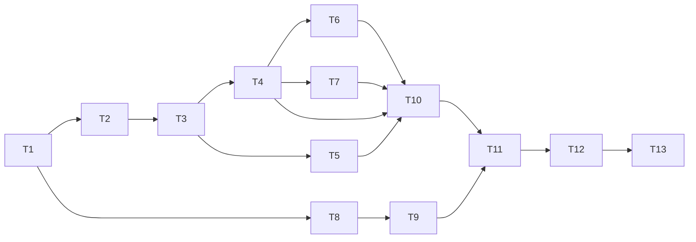

# PLAN: Foundation v6 Update

> Mode: PLANNING ONLY (chưa viết code). Agent: `project-planner`.
> Nguồn: `docs/01..17 v6` (business gửi) so với v5 đang dùng. Branch đề xuất: `feat/foundation-v6`.

## 1. Overview

Business đã cập nhật bộ spec lên **v6** (thay v5). Plan này cập nhật foundation Express + MongoDB đã làm (branch `feat/mongo-foundation`) cho khớp v6, đồng thời sửa các chỗ foundation hiện tại **đang hỏng hoặc lệch spec** mà đợt rà soát này phát hiện.

**Project type:** BACKEND (Node.js + Express + MongoDB). Không có phần UI.

### 1.1 v5 → v6: thay đổi nào ảnh hưởng foundation?

V6 chỉ thay đổi nghiệp vụ Appointment/Payment (7 mục feedback). Phần "hợp đồng chung" của foundation gần như giữ nguyên:

| Hạng mục | v5 | v6 | Ảnh hưởng foundation |
|---|---|---|---|
| File spec | `07-openapi-v5.yaml` | `07-openapi-v6.yaml` (143 operation, 3.1.1, server `/api/v1`) | **`app.js` đang trỏ file v5 đã bị xóa** |
| `ErrorCode` | có `INCOMPATIBLE_STAFF_ROLES` | bỏ nó, thêm `STAFF_ROLE_MISMATCH`, `STAFF_UNAVAILABLE` (32 code) | Cập nhật danh sách code |
| `Problem` schema | có `suggestedGroups` | bỏ `suggestedGroups` | Xóa khỏi `AppError` + `errorHandler` |
| Security / CORS / rate limit / helmet | CORS allowlist 2 origin, JWT 15m + refresh rotation | không đổi | Giữ nguyên |
| Idempotency-Key | header bắt buộc cho POST nhạy cảm | không đổi (143 op, 1 op bỏ `bookingPaymentCreate`) | Validator tự kiểm tra header |
| Enum / role | 4 systemRole, 4 staffSubRole | không đổi; thêm `PaymentKind.FULL`, `AppointmentPaymentMethod` | Chưa ảnh hưởng foundation (thuộc module Payment/Booking) |
| Domain (appointment segment, payment FULL/DEPOSIT, `slot_reservations` STAFF/CAPACITY, `assignedStaffIds`, reassign API) | v5 | mới | **Không thuộc foundation**, chỉ ghi nhận cho các task module sau (mục 8) |

### 1.2 Vấn đề phát hiện ở foundation hiện tại (cần nói rõ)

| # | Vấn đề | Mức độ | Bằng chứng |
|---|---|---|---|
| P1 | `src/app.js` trỏ `docs/07-openapi-v5.yaml`, file này đã bị xóa khỏi working tree (v6 thay thế) → server sẽ lỗi khi khởi động | 🔴 Chặn | `git status`: `D docs/07-openapi-v5.yaml` |
| P2 | `removeAdditional: 'failing'` có thể **âm thầm cắt field thừa** thay vì trả 400, trái với doc 13/14 ("field thừa / gửi giá → 400") | 🟠 Cần kiểm chứng bằng test | cấu hình trong `app.js` |
| P3 | Chưa trả header `X-Correlation-Id` ở response (task T4 ghi "header trả về cùng giá trị") | 🟠 Lệch kế hoạch | `logger.js` không `setHeader` |
| P4 | `AppError`/`errorHandler` còn `suggestedGroups` (đã bị xóa khỏi spec) | 🟠 Lệch v6 | `AppError.js`, `errorHandler.js` |
| P5 | Error code đang là chuỗi viết tay, không có nguồn sự thật → dễ lệch spec (đã lệch ở P4) | 🟡 | rải rác trong code |
| P6 | **Chưa có test tự động nào** (không có Jest/supertest), dù T11 trong `foundation-setup.md` và báo cáo đã ghi "hoàn thành" | 🔴 Báo cáo cần đính chính | `package.json` không có test script/devDeps |
| P7 | Lỗi CORS (origin lạ) đi qua `errorHandler` thành 500 `INTERNAL_ERROR` | 🟡 | `app.js` CORS callback |
| P8 | Còn file legacy lẫn trong `src/` (`configs/prisma.js`, `utils/prismaHelpers.js`, `middleware/*`, `utils/ApiResponse.js`, `utils/responseHelpers.js`, `configs/viewEngine.js`, `configs/cors.js`...) và `package.json` còn script/deps Prisma (`build`, `prisma:*`, `seed`) | 🟠 Nhiễu + build hỏng | cây `src/` hiện tại |
| P9 | `auth` middleware chỉ đọc claim từ JWT; doc 03/08 yêu cầu actor lấy từ **token + DB** (BLOCKED phải bị chặn ngay) | 🟡 Để task Auth | `shared/authMiddleware.js` |
| P10 | Doc `18`, `19`, `foundation-setup.md` ghi v5 và ghi toàn bộ `[x]` kể cả mục chưa làm thật | 🟠 Tài liệu sai | các file đó |

> Đính chính: ở lần báo cáo trước mình đã xác nhận "validation trả đúng format" dựa trên 404/health, chưa chạy thử request sai body qua validator. Plan này đưa việc đó vào kiểm chứng thật (T6, T10).

## 2. Success Criteria

- [ ] Server khởi động sạch với spec v6, không còn tham chiếu v5.
- [ ] Mọi lỗi (404, JSON hỏng, body thừa field, thiếu `Idempotency-Key`, ObjectId sai, CORS, 500) trả `application/problem+json` với `type,title,status,code,correlationId,instance`; `code` thuộc đúng 32 giá trị `ErrorCode` v6.
- [ ] Response có header `X-Correlation-Id`, trùng `correlationId` trong body lỗi và trong log.
- [ ] Danh sách `ErrorCode` trong code được test tự động đối chiếu với `07-openapi-v6.yaml` (lệch = test fail).
- [ ] Body thừa field / client gửi field server-authority → 400 `VALIDATION_ERROR` (không bị cắt âm thầm).
- [ ] `npm test` chạy được, bao phủ error handler, validation, auth middleware, health; `npm run build`/`start` không phụ thuộc Prisma.
- [ ] `src/` chỉ còn code foundation mới; legacy nằm trong `legacy/`.
- [ ] Doc 18, 19, `foundation-setup.md` phản ánh đúng thực tế (v6, trạng thái thật).

## 3. Tech Stack (không thêm dependency ngoài test)

| Thành phần | Quyết định | Lý do |
|---|---|---|
| Validator | Giữ `express-openapi-validator` (đã `^5.6.2`, hỗ trợ 3.1) | Spec là nguồn duy nhất (doc 14) |
| Spec path | Hằng trong `config` (`OPENAPI_SPEC_PATH`, mặc định `docs/07-openapi-v6.yaml`) | Lần sau lên v7 chỉ đổi 1 chỗ |
| Test | **Jest + supertest** (devDependencies, mới) | Doc 14 yêu cầu contract test; chưa có framework nào; dùng được với Babel hiện có |
| Mongo trong test | Mock `mongoose.connection.readyState`, không kết nối DB thật | Test nhanh, không cần Atlas |

## 4. File Structure (đích)

```
src/
  app.js                 # giữ, sửa spec path + validator options + correlation header + CORS error
  server.js              # giữ
  shared/
    config.js            # + OPENAPI_SPEC_PATH
    errorCodes.js        # MỚI: hằng ErrorCode v6 (32 giá trị)
    errorHandler.js      # bỏ suggestedGroups, dùng errorCodes, map lỗi body-parser/CORS
    logger.js            # + set X-Correlation-Id
    authMiddleware.js    # giữ (phần DB-lookup để task Auth)
    responseHelpers.js   # giữ
  routes/health.js       # giữ
  utils/AppError.js      # bỏ suggestedGroups
tests/
  setup.js               # set env giả cho config
  errorCodes.spec.js     # đối chiếu với OpenAPI v6
  errorHandler.spec.js
  validation.spec.js
  authMiddleware.spec.js
  health.spec.js
legacy/                  # chuyển thêm các file legacy còn trong src/
```

## 5. Task Breakdown

Quy ước: ID `V6-Tn` · Agent/Skill đề xuất · Dependencies · INPUT → OUTPUT → VERIFY · Rollback.

### Phase A: Chuẩn bị và gỡ chặn

**V6-T1 Chốt bộ docs v6 vào git** · `backend-specialist` · skill `clean-code` · deps: không
- INPUT: working tree có `D` v5 (17 file + zip) và `??` v6 (17 file + zip).
- OUTPUT: branch `feat/foundation-v6`, 1 commit `docs: replace spec v5 with v6` (xóa v5, thêm v6).
- VERIFY: `git status docs` sạch; `git log -1 --stat` thấy 17 file v5 xóa, 17 file v6 thêm.
- Rollback: `git reset --soft HEAD~1`.

**V6-T2 Sửa đường dẫn spec, đưa vào config** · `backend-specialist` · skill `nodejs-best-practices` · deps: T1
- INPUT: `app.js` (hằng `apiSpecPath`), `shared/config.js`.
- OUTPUT: `config.openapiSpecPath` (env override), `app.js` dùng giá trị này; fail-fast nếu file không tồn tại (thông báo rõ).
- VERIFY: `npm run dev` lên được; đổi env sang đường dẫn sai → process thoát có thông báo "OpenAPI spec not found".
- Rollback: revert commit.

### Phase B: Khớp hợp đồng lỗi v6

**V6-T3 Nguồn sự thật cho ErrorCode** · `backend-specialist` · skill `api-patterns` · deps: T2
- INPUT: `components.schemas.ErrorCode` trong `07-openapi-v6.yaml` (32 giá trị).
- OUTPUT: `src/shared/errorCodes.js` (object `ErrorCodes` đóng băng); thay chuỗi viết tay trong `errorHandler.js`, `routes/health.js`, `authMiddleware.js`, `AppError` usage.
- VERIFY: `grep` không còn chuỗi code viết tay ngoài `errorCodes.js`; test đối chiếu spec (T10) xanh.
- Rollback: revert commit.

**V6-T4 Cập nhật `AppError` và `errorHandler` theo Problem v6** · `backend-specialist` · skill `api-patterns` · deps: T3
- OUTPUT:
  - Xóa `suggestedGroups` ở `AppError` và `errorHandler`.
  - Map thêm: `entity.parse.failed` → 400 `VALIDATION_ERROR`; `entity.too.large` → 413 (code theo mục "Câu hỏi mở" #2); lỗi CORS → 403 `AUTHORIZATION_ERROR`; lỗi không biết → 500 `INTERNAL_ERROR` **không lộ stack/message nội bộ**.
  - Giữ `application/problem+json`, `type` dạng uri-reference, `instance`, `errors[]` chỉ gồm `field,message,code`.
- VERIFY: gọi 5 trường hợp (route lạ, JSON hỏng, body quá lớn, origin lạ, ném lỗi bất kỳ) → đúng status + code + content-type (T10).
- Rollback: revert commit.

**V6-T5 Header `X-Correlation-Id`** · `backend-specialist` · skill `nodejs-best-practices` · deps: T3
- OUTPUT: `logger.js` gán `res.setHeader('X-Correlation-Id', req.id)`; CORS `exposedHeaders` có header này; chuẩn hóa id nhận vào (giới hạn độ dài/ký tự để tránh log injection).
- VERIFY: response của `/api/v1/health` có header; gửi `X-Correlation-Id: abc` → header trả lại `abc`; gửi chuỗi quá dài/ký tự lạ → sinh UUID mới.
- Rollback: revert commit.

### Phase C: Validation đúng cam kết

**V6-T6 Chỉnh cấu hình validator + kiểm chứng body thừa field** · `security-auditor` + `backend-specialist` · skill `vulnerability-scanner`, `api-patterns` · deps: T2, T4
- INPUT: option `removeAdditional: 'failing'` (P2).
- OUTPUT: bỏ `removeAdditional` (mặc định reject theo `additionalProperties:false`); bật `validateRequests` giữ nguyên; `validateResponses` chỉ bật khi `NODE_ENV !== 'production'` (để bắt lệch contract khi dev/test); thêm chặn key bắt đầu `$` / chứa `.` ở body (doc 13 mục Input) bằng middleware nhỏ.
- VERIFY: ví dụ `POST /api/v1/auth/login` với field thừa → 400 `VALIDATION_ERROR` có `errors[]`; thiếu `Idempotency-Key` ở op nhạy cảm → 400; body có key `$where` → 400.
- Rollback: revert commit; nếu validator làm các op chưa implement trả 404 sai thì giữ `ignoreUndocumented`.
- Rủi ro: op có trong spec nhưng chưa có handler sẽ qua validator rồi rơi vào 404 handler (đúng/chấp nhận được ở giai đoạn foundation; ghi rõ trong doc 19).

**V6-T7 Rate limit nền + chặn lỗi CORS thân thiện** · `security-auditor` · skill `vulnerability-scanner` · deps: T4
- OUTPUT: giữ limiter toàn cục nhưng đọc ngưỡng từ config (`RATE_LIMIT_WINDOW_MS`, `RATE_LIMIT_MAX`) thay vì hard-code 100/15 phút; trả đúng `Problem` + code `RATE_LIMIT` qua `errorHandler`. Limiter riêng cho login/OTP/voucher/checkout để task Auth/Commerce (ghi chú trong doc).
- VERIFY: vượt ngưỡng → 429 `application/problem+json`, `code: RATE_LIMIT`, có `correlationId`.
- Rollback: revert commit.

### Phase D: Dọn dẹp cấu trúc

**V6-T8 Phân loại và chuyển file legacy còn trong `src/`** · `backend-specialist` · skill `clean-code` · deps: T1
- INPUT: mục P8. Phân loại từng file: (a) Prisma/MySQL/EJS → `legacy/`; (b) helper dùng lại được cho Auth (`jwtHelpers`, `otpHelpers`, `passwordHelpers`, `emailHelpers`) → giữ nhưng gắn nhãn; (c) trùng chức năng với `shared/*` (`middleware/errorHandler`, `utils/ApiResponse`, `utils/responseHelpers`) → `legacy/`.
- OUTPUT: bảng phân loại ngắn trong PR + `git mv` các file nhóm (a), (c); không xóa vĩnh viễn.
- VERIFY: `grep -r "prisma" src` không còn kết quả; server vẫn lên; không import nào trỏ vào file đã chuyển.
- Rollback: `git revert`.

**V6-T9 Sửa `package.json` và build** · `backend-specialist` · skill `nodejs-best-practices` · deps: T8
- OUTPUT: bỏ script `prisma:*`, `seed`, `services:enable-weight-surcharge`, bỏ `prisma generate` khỏi `build`; bỏ `@prisma/client`/`prisma` (và các dep chỉ legacy dùng nếu chắc chắn: `cookie-parser`, `body-parser`, `multer`, `node-cron`, `lodash`, `nodemailer` → **giữ lại cho đến khi task dùng/loại rõ ràng**; chỉ bỏ Prisma); thêm script `test`, `lint` nếu đã có cấu hình.
- VERIFY: `npm install` sạch; `npm run build` thành công; `npm start` (từ `dist`) chạy được.
- Rollback: khôi phục `package.json` từ git.

### Phase E: Test thật và tài liệu

**V6-T10 Dựng test tự động** · `test-engineer` · skill `testing-patterns`, `tdd-workflow` · deps: T3–T7
- INPUT: thêm devDependencies `jest`, `supertest`, `babel-jest` (cần xác nhận được thêm dep).
- OUTPUT: `tests/*.spec.js` như mục 4. Nội dung chính:
  - `errorCodes.spec`: tập `ErrorCodes` **bằng đúng** enum `ErrorCode` trong spec v6.
  - `errorHandler.spec`: 404, JSON hỏng, body lớn, CORS, lỗi 500 không lộ stack; mọi lỗi có `correlationId` khớp header.
  - `validation.spec`: field thừa → 400; thiếu `Idempotency-Key` → 400; key `$` → 400.
  - `authMiddleware.spec`: không token 401 `AUTHENTICATION_ERROR`; token sai/hết hạn 401; sai role 403 `AUTHORIZATION_ERROR`; đúng role đi tiếp; `STAFF` + sub-role.
  - `health.spec`: `/health` 200; `/health/ready` 200 khi `readyState=1`, 503 khi khác.
- VERIFY: `npm test` xanh; cố ý sửa 1 code trong `errorCodes.js` → test đối chiếu spec fail.
- Rollback: xóa `tests/` và devDeps vừa thêm.

**V6-T11 Smoke test thủ công + quét bảo mật** · `security-auditor` · skill `vulnerability-scanner` · deps: T10
- OUTPUT: chạy `npm run dev` + curl (dùng `curl.exe`, tránh alias `Invoke-WebRequest` của PowerShell) cho các case trong T4/T5/T6; chạy `security_scan.py`, `lint_runner.py`.
- VERIFY: không còn lỗi Critical/High do code mình; kết quả ghi vào PR.

**V6-T12 Cập nhật tài liệu cho đúng thực tế** · `backend-specialist` · skill `documentation-templates` · deps: T11
- OUTPUT: sửa `docs/19-foundation-architecture-details.md` (spec v6, errorCodes, header correlation, validator option, test); sửa `docs/18-report-foundation-setup.md` (thêm mục đính chính + trạng thái test thật); sửa `foundation-setup.md` (bỏ tick những mục chưa thật sự kiểm chứng; ghi T11 cũ nay hoàn tất bằng plan này).
- VERIFY: không còn chữ `v5`/`ApiResponse` sai ngữ cảnh trong 3 file này (`grep`).

**V6-T13 Commit và push** · deps: T12
- OUTPUT: các commit nhỏ theo phase, push `feat/foundation-v6`, mở PR vào branch chính.
- VERIFY: PR có mô tả: delta v5→v6, danh sách P1–P10, kết quả test.

### Dependency graph



Song song được: T5 ∥ T4 (khác file chính); T8–T9 ∥ T3–T7 (khác vùng file, chỉ chung `package.json` ở T9/T10 nên T9 làm trước T10).

## 6. Rủi ro và quyết định cần lưu ý

| Rủi ro | Cách xử lý |
|---|---|
| Bỏ `removeAdditional` làm các request hiện có của FE bị 400 khi FE vẫn gửi field thừa | Đúng ý spec (`additionalProperties:false`); báo FE; chỉ ảnh hưởng khi op đã có handler |
| `validateResponses` lúc dev bắt lệch contract hàng loạt khi module mới viết dở | Chỉ bật ngoài production, có biến tắt (`VALIDATE_RESPONSES=false`) |
| Thêm Jest/supertest = dependency mới | Cần bạn đồng ý (ở mục câu hỏi mở #1); chỉ devDependencies |
| Xóa dep Prisma làm legacy không chạy được | Chấp nhận, `legacy/` chỉ để tham khảo (đã thống nhất trước đó) |
| Spec v6 đã có file `files (6).zip`/CSV 17 chưa được sửa sheet (doc 16 mục 16.6) | Ngoài phạm vi foundation, chỉ ghi nhận |

## 7. Câu hỏi mở (trả lời ngắn khi duyệt plan)

1. Được phép thêm devDependencies `jest`, `supertest`, `babel-jest` không? (Mặc định: có.)
2. Body quá lớn (>1mb): trả `413` với `code: VALIDATION_ERROR`, hay `400 VALIDATION_ERROR`? Spec không có code riêng cho 413. (Mặc định: 413 + `VALIDATION_ERROR`.)
3. Branch: tạo `feat/foundation-v6` từ `feat/mongo-foundation`, hay đợi PR trước được merge rồi cắt từ main? (Mặc định: cắt từ `feat/mongo-foundation`.)

## 8. Ghi nhận cho các task module sau (không làm trong plan này)

| Thay đổi v6 | Module chịu ảnh hưởng |
|---|---|
| Appointment = nhiều segment, mỗi segment `requiredStaffRole`, `assignedStaffId` riêng, backend tự tìm và giữ staff; slot chỉ khả dụng nếu mọi segment có staff | booking, availability engine |
| `slot_reservations` tách `STAFF` (unique staff+slot) và `CAPACITY` | booking, index (doc 06) |
| `appointmentSegmentReassign` (`PUT /appointments/{id}/segments/{serviceId}/staff`), lỗi `STAFF_ROLE_MISMATCH` (422), `STAFF_UNAVAILABLE` (409) | booking, authz |
| Tạo lịch nội bộ không bao giờ ra `CONFIRMED`; chỉ `appointmentsConfirm` | booking |
| ONLINE_MOCK = 100% (`FULL`), PAY_AT_STORE = cọc 30% (`DEPOSIT`) + `BALANCE`; ghi nhận `paidAmount` ngay; `APPLIED` tự động khi COMPLETED; bỏ `bookingPaymentCreate` | payment, booking |
| COD chỉ `PAID` khi Mark Delivered; `record-at-store` chỉ cho Appointment PAY_AT_STORE | order, payment |
| `ServiceRecord.assignedStaffIds[]` thay `assignedStaffId` | serviceExecution |

## Phase X: Verification (chạy thật, không tick khi chưa chạy)

- [ ] `npm install` sạch, không còn `@prisma/client`/`prisma`
- [ ] `npm test` xanh (T10)
- [ ] `npm run build` thành công và `npm start` chạy từ `dist`
- [ ] `python .agent/scripts/checklist.py .` (Security → Lint → Tests)
- [ ] `python .agent/skills/vulnerability-scanner/scripts/security_scan.py .`
- [ ] Smoke test bằng `curl.exe`: health, route lạ, JSON hỏng, field thừa, thiếu `Idempotency-Key`, origin lạ, vượt rate limit
- [ ] `docs/18`, `docs/19`, `foundation-setup.md` đã đính chính
- [ ] Đã ghi dấu `## ✅ PHASE X COMPLETE` vào cuối file này sau khi tất cả ở trên đạt
