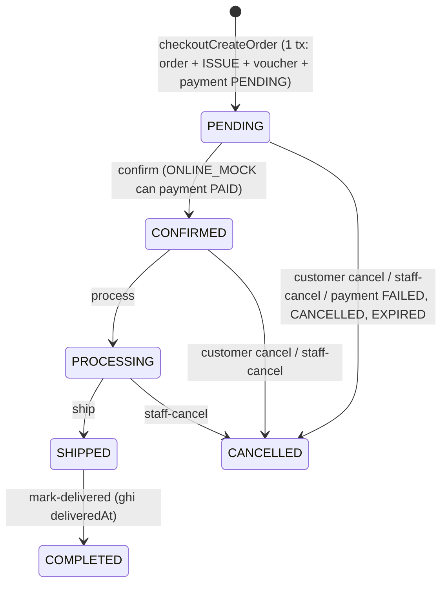
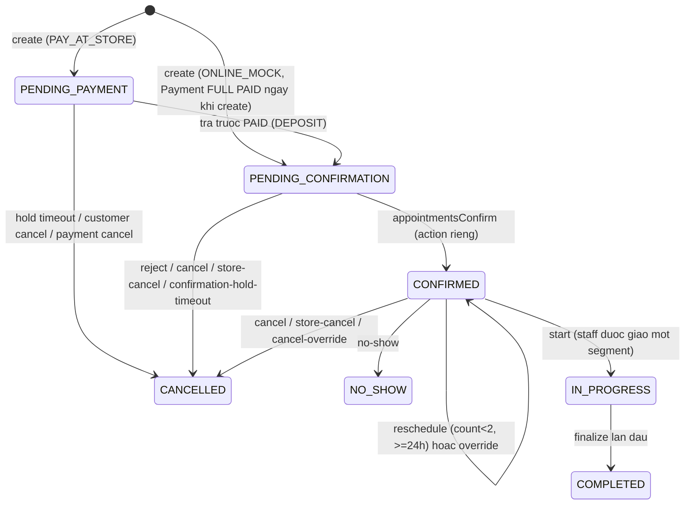
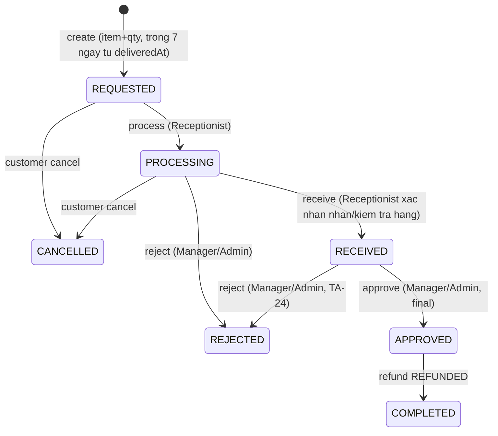

# 09 State Machines v7

Moi transition la action endpoint; audit; actor/role do server suy ra.

## 9.1 Activation: NO_ACCOUNT > PENDING_ACTIVATION (activationInviteSend) > ACTIVATED (activationComplete: OTP + password 8+ ky tu co chu hoa va so + acceptTerms). Cam tu sinh password.
## 9.2 AccountStatus (feedback 5)
ACTIVE --block--> BLOCKED; BLOCKED --unblock--> ACTIVE. **Chi ADMIN**, reason bat buoc, audit, revoke refresh. Manager khong co transition nay (403). BLOCKED chi chan login, khong chan hay xoa lich su giao dich.

## 9.3 Order (M08, BF02)

| From | Action | Actor | Pre | To | Side effects |
|---|---|---|---|---|---|
| (new) | checkoutCreateOrder | Customer/Guest | cart hop le, product ACTIVE, ton du, voucher hop le | PENDING | 1 tx: Order + pricing + consume voucher + ISSUE ledger + conditional stock decrement + Payment PENDING. `fulfillmentBranchId` do FulfillmentBranchResolver gan (branch ACTIVE dau tien trong fulfillmentBranchPriority du ton cho toan bo cart); khong du => INSUFFICIENT_INVENTORY |
| PENDING | ordersConfirm | Receptionist/Manager/Admin | ONLINE_MOCK: payment PAID; COD: khong can | CONFIRMED | notification |
| CONFIRMED | ordersProcess | nt | -- | PROCESSING | -- |
| PROCESSING | ordersShip | nt | -- | SHIPPED | carrier/tracking |
| SHIPPED | ordersMarkDelivered | nt | -- | COMPLETED | `deliveredAt = now`; **COD payment PENDING -> PAID chi o buoc nay** (khong qua record-at-store); mo cua so tra 7 ngay |
| PENDING/CONFIRMED | ordersCancel | Customer/Guest | OWN | CANCELLED | compensating tx (xem duoi) |
| PENDING/CONFIRMED/PROCESSING | ordersStaffCancel | Receptionist/Manager/Admin | reason | CANCELLED | compensating tx |
| PENDING | (payment FAILED/CANCELLED/EXPIRED) | system | payment ONLINE_MOCK terminal | CANCELLED | compensating tx |
**Compensating transaction (1 tx, idempotent)**: Order CANCELLED; moi dong ISSUE duoc doi ung bang RECEIPT (sourceType ORDER, unique (ORDER, orderId, item, RECEIPT) => khong hoan 2 lan); restore voucher quota (unique voucher_usages); payment o terminal state. Neu payment da PAID: payment REFUND_PENDING + OrderRefund cause CANCELLATION.
Cam: huy khi SHIPPED/COMPLETED; hard delete; client set status. Khong co retry thanh toan, khong queue, khong doi soat.

## 9.4 Payment (mock)
PENDING --PAID (mock complete; record-at-store chi cho Appointment PAY_AT_STORE; Order COD chi khi Mark Delivered)--> PAID **chi khi target chua CANCELLED/terminal**. PENDING --FAILED (mock callback)--> FAILED. Với Payment DEPOSIT của Appointment, FAILED/CANCELLED/EXPIRED đồng thời làm Appointment -> CANCELLED và release reservation; không retry. PENDING --paymentsCancel--> CANCELLED. PENDING --timeout job (ONLINE_MOCK)--> EXPIRED. FAILED/CANCELLED/EXPIRED la terminal (khong tai su dung; tao thanh toan moi la luong ngoai scope hien tai). PAID --refund--> REFUND_PENDING --> REFUNDED (hoan het) hoac PAID (hoan mot phan, `refundedAmount` cong don).
Method: Appointment: ONLINE_MOCK, PAY_AT_STORE. Order: ONLINE_MOCK, COD. Target: ORDER | APPOINTMENT. Kind: FULL (ONLINE_MOCK lich hen), DEPOSIT, BALANCE (PAY_AT_STORE), ORDER.
Callback lap lai (failure/cancel/expire): no-op, tra trang thai hien tai, khong ghi ledger 2 lan. Timeout: thoi han la cau hinh ky thuat.
Cam: PAID > PENDING; terminal failure > PAID.

## 9.5 Appointment

**Phan cong staff khong phai confirm.** Tao Appointment (tu dat, dat ho, duyet request) vao `PENDING_CONFIRMATION` neu `ONLINE_MOCK` (Payment FULL da PAID trong cung transaction), vao `PENDING_PAYMENT` neu `PAY_AT_STORE`. Tu dong tim staff, `staffAssignments` luc dat ho, hoac `appointmentSegmentReassign` chi doi nguoi thuc hien, khong doi trang thai. Chi `appointmentsConfirm` (Receptionist/Manager/Admin) chuyen sang CONFIRMED. `PENDING_CONFIRMATION` phải có `holdExpiresAt`; job hết hạn tự chuyển CANCELLED và release staff/capacity reservations.
| From | Action | Actor | Pre | To | Errors | Side |
|---|---|---|---|---|---|---|
| (new) | appointmentsCreate | Customer/Guest | tat ca service BOOKABLE, cung serviceType, enabled tai branch; moi segment tim duoc staff; `paymentMethod` | PENDING_CONFIRMATION (ONLINE_MOCK) / PENDING_PAYMENT (PAY_AT_STORE) | MIXED_SERVICE_TYPES, SERVICE_NOT_ENABLED_AT_BRANCH, BOOKING_MODE_NOT_ALLOWED, SLOT_UNAVAILABLE | reserve staff + capacity tung segment; ONLINE_MOCK: Payment FULL 100% = PAID ngay trong tx; PAY_AT_STORE: Payment DEPOSIT 30%; cọc luôn ONLINE_MOCK; Customer/Guest hoàn tất qua paymentMockComplete |
| (new) | internalAppointmentsCreate | Receptionist/Manager/Admin | nhu tren; `customerId` XOR `contact`; `staffAssignments` tuy chon (trung requiredStaffRole, available) | PENDING_CONFIRMATION (ONLINE_MOCK) / PENDING_PAYMENT (PAY_AT_STORE) | nhu tren + STAFF_ROLE_MISMATCH, STAFF_UNAVAILABLE | ONLINE_MOCK FULL da PAID ngay; PAY_AT_STORE cho DEPOSIT PAID; **khong CONFIRMED** du da gan staff |
| UNDER_REVIEW | appointmentRequestsApprove | Receptionist/Manager/Admin | branch scope, available chain | APPROVED | SLOT_UNAVAILABLE | same transaction creates one Appointment; ONLINE_MOCK FULL PAID -> PENDING_CONFIRMATION; PAY_AT_STORE ONLINE_MOCK DEPOSIT PENDING -> PENDING_PAYMENT; return Appointment including prepaymentId; assignment never confirms |
| PENDING_PAYMENT | (DEPOSIT PAID) | system | PAY_AT_STORE, tra truoc thanh cong | PENDING_CONFIRMATION | -- | ghi nhan `paidAmount` ngay; deposit HELD; khong ap dung cho ONLINE_MOCK vi FULL da PAID ngay khi create |
| PENDING_PAYMENT | (DEPOSIT FAILED/CANCELLED/EXPIRED) | system | prepayment khong thanh cong | CANCELLED | PAYMENT_STATE_ERROR neu callback sau terminal | Payment terminal + release staff/capacity reservation; khong retry |
| PENDING_CONFIRMATION | appointmentsConfirm | Receptionist/Manager/Admin | hold chua het han; neu co prepayment thi da PAID; moi segment da co staff | CONFIRMED | INVALID_STATE_TRANSITION | notify; holdExpiresAt -> null; HELD reservations -> CONFIRMED |
| CONFIRMED | appointmentsReschedule | Customer | >=24h truoc gio hen, count<2 | CONFIRMED | RESCHEDULE_TOO_LATE, RESCHEDULE_LIMIT, SLOT_UNAVAILABLE | tim lai staff tung segment o khung moi; khoan tra truoc chuyen sang lich moi |
| CONFIRMED | appointmentsRescheduleOverride | Manager(BR)/Admin | reason | CONFIRMED | -- | audit |
| PENDING_PAYMENT/PENDING_CONFIRMATION/CONFIRMED | appointmentsCancel | Customer | OWN | CANCELLED | -- | >=24h tao BookingRefund REQUESTED 100% khoan tra truoc; <24h/no-show giữ 30% finalAmount và hoàn phần trả trước còn lại; giai phong reservation |
| PENDING_PAYMENT/PENDING_CONFIRMATION/CONFIRMED | appointmentsStoreCancel | Receptionist/Manager/Admin | reason | CANCELLED | -- | system/store cancellation: neu co prepayment tao BookingRefund REQUESTED 100% (khong ap dung <24h forfeiture cho system/store cancel); neu khong co prepayment thi khong tao refund |
| PENDING_PAYMENT/PENDING_CONFIRMATION/CONFIRMED | appointmentsCancelOverride | Manager(BR)/Admin | reason, prepaidOutcome? | CANCELLED | -- | TA-30 (CONFIRMED 08/10/2026): hủy >=24h hoàn 100%; hủy <24h/no-show giữ round(finalAmount * 0.30), hoàn phần đã trả còn lại. ONLINE_MOCK hoàn 70%; PAY_AT_STORE mất cọc 30%. Store/system cancel hoàn 100%; reschedule-override giữ payment trên cùng Appointment. |
| CONFIRMED | appointmentsMarkNoShow | Receptionist/Manager/Admin | now > start + grace (booking.noShowGraceMinutes technical config) | NO_SHOW | -- | giữ 30% finalAmount, hoàn phần trả trước còn lại |
| CONFIRMED | appointmentsStart | staff duoc giao mot segment (Care/Nurse/Vet) | sub-role dung serviceType | IN_PROGRESS | ASSIGNMENT_SCOPE_ERROR | tao service_record |
| IN_PROGRESS | (finalize) | xem 9.10 | -- | COMPLETED | -- | deposit HELD->APPLIED (system) |
Reassign segment (`appointmentSegmentReassign`) khong doi trang thai; chi cho segment chua bat dau, staff moi cung `requiredStaffRole`.

**Segment execution invariant:** mỗi `appointments.services[]` item có `executionStatus` riêng. `NOT_STARTED -> IN_PROGRESS -> COMPLETED`; segment sau chỉ được start khi segment trước đã COMPLETED. Appointment chỉ được `COMPLETED` khi **tất cả segments** đã COMPLETED và encounter-level `ServiceRecord` được overall finalize. Complete một segment không tự tạo inventory ledger/revision và không đóng Appointment.


## 9.5a Segment execution
```
NOT_STARTED -> IN_PROGRESS -> COMPLETED
```
- `appointmentsStart(serviceId)`: chi staff duoc giao segment, dung ServiceExecutionRole, previous segment da COMPLETED, den thoi gian; segment 1 co the doi Appointment CONFIRMED -> IN_PROGRESS.
- `serviceRecordsSubmitReview(serviceId)`: Nurse dung cho MEDICAL segment; segment `IN_PROGRESS -> COMPLETED`, khong tao inventory ledger.
- `serviceRecordsFinalize(serviceId)`: Care/Groomer dung GROOMING segment; Vet dung MEDICAL segment. Segment `IN_PROGRESS -> COMPLETED`; GROOMING: last segment có thể finalize overall. MEDICAL: khi tất cả segment COMPLETED chuyển WAITING_VET_REVIEW, reviewer Vet finalize riêng không serviceId; chỉ overall finalize tạo revision/inventory delta và Appointment COMPLETED.
- MEDICAL (CONFIRMED 08/10/2026): Appointment có thể gồm service do NURSE và/hoặc VETERINARIAN thực hiện, không bắt buộc Vet execution segment. Service cần Vet trực tiếp tham gia phải có requiredStaffRole = VETERINARIAN. ServiceRecord MEDICAL bắt buộc được Veterinarian review và finalize. Nurse chỉ hoàn tất phần thực hiện và submit; khi mọi segment COMPLETED, hồ sơ sang WAITING_VET_REVIEW. reviewerStaffId là Vet được Receptionist/Manager/Admin giao riêng theo branch; chỉ reviewer Vet ghi professional và finalize encounter. Review không phải service segment và không tạo reservation lịch.
- Reopen la encounter-level correction: ServiceRecord FINALIZED -> REOPENED; segment status giu nguyen; finalize lai tao revision moi, Appointment van COMPLETED.

## 9.6 Deposit va tra truoc
Deposit ONLINE option NOT_REQUIRED. PAY_AT_STORE option: PENDING -> HELD khi mock cọc PAID -> APPLIED tự động khi COMPLETED; hủy sớm/system refund => REFUNDED; hủy sát giờ/no-show => FORFEITED. paidAmount cộng ngay khi thành công, không đợi balance; balanceAmount=finalAmount-depositAmount, số cần thu hiện tại=finalAmount-paidAmount.
- TA-30 (CONFIRMED 08/10/2026): hủy >=24h hoàn 100%; hủy <24h/no-show giữ round(finalAmount * 0.30), hoàn phần đã trả còn lại. ONLINE_MOCK hoàn 70%; PAY_AT_STORE mất cọc 30%. Store/system cancel hoàn 100%; reschedule-override giữ payment trên cùng Appointment.
## 9.7 Booking Refund
REQUESTED > PROCESSING (Receptionist/Manager/Admin) > APPROVED (Manager/Admin) > REFUNDED (mock) | REJECTED. Receptionist khong approve.
- TA-30 (CONFIRMED 08/10/2026): hủy >=24h hoàn 100%; hủy <24h/no-show giữ round(finalAmount * 0.30), hoàn phần đã trả còn lại. ONLINE_MOCK hoàn 70%; PAY_AT_STORE mất cọc 30%. Store/system cancel hoàn 100%; reschedule-override giữ payment trên cùng Appointment.
- System/store rejection or PENDING_CONFIRMATION timeout with prepayment creates a 100% refund request regardless of elapsed hours because the failure is not customer-initiated.
- Booking refund is only for prepayment; PAY_AT_STORE = 30% deposit, ONLINE_MOCK = 100% finalAmount. No TRANSFER outcome.

## 9.8 OrderReturn (M09)

| From | Action | Actor | Pre | To | Side |
|---|---|---|---|---|---|
| (new) | orderReturnCreate | Customer/Guest | order COMPLETED co deliveredAt, now <= deliveredAt + 7d, 0 < qty <= returnableQty | REQUESTED | tinh san refund (phan thuc tra sau discount); giu `returnReservedQty` |
| REQUESTED | orderReturnProcess | Receptionist | kiem tra ly do/bang chung | PROCESSING | -- |
| PROCESSING | orderReturnReceive | Receptionist | -- | RECEIVED | khong refund, khong doi ton kho |
| RECEIVED | orderReturnApprove | Manager/Admin | hang da nhan | APPROVED | dong bang refundBreakdown; tao OrderRefund PENDING |
| PROCESSING/RECEIVED | orderReturnReject | Manager/Admin | reason | REJECTED | tra lai returnReservedQty. **Tu RECEIVED: khong refund, khong nhap stock, khong tao OrderRefund; hang tra lai Customer xu ly thu cong/out-of-system** |
| REQUESTED/PROCESSING | orderReturnCancel | Customer | -- | CANCELLED | tra lai returnReservedQty |
`APPROVED` = final approve sau khi hang da duoc nhan, khong phai "cho phep gui hang ve". Receptionist khong approve/reject. Loi: RETURN_WINDOW_EXPIRED, RETURN_QTY_EXCEEDS_RETURNABLE, INVALID_STATE_TRANSITION.
## 9.9 OrderRefund
PENDING --process (Manager/Admin, mock)--> REFUNDED (OrderReturn APPROVED > COMPLETED; payment.refundedAmount cong don) | FAILED -> PENDING (retry same OrderRefund document). Provider failure returns Payment to PAID before retry. Amount = refundBreakdown.total, khong sua duoc. Cause CANCELLATION: orderReturnId null.

## 9.10 ServiceRecord
MEDICAL: DRAFT > IN_PROGRESS > WAITING_VET_REVIEW (Nurse submit) > FINALIZED (chi Veterinarian). GROOMING: IN_PROGRESS > FINALIZED. ActualMaterials chi sua khi IN_PROGRESS/REOPENED va boi Care/Groomer (GROOMING) hoac Nurse (MEDICAL); Professional chi Vet va khong sua FINALIZED neu chua reopen. (Care Staff). FINALIZED > REOPENED (Manager/Admin, reason) > finalize lai (grooming) hoac WAITING_VET_REVIEW > FINALIZED (medical). Finalize (tx): revision N, delta = newActual - previousActual theo vat tu (lan 1 previous = 0); delta>0 ISSUE; delta<0 ADJUSTMENT; thieu ton 422 khong ghi gi; appointment COMPLETED chi lan dau. Ledger cu khong sua.
## 9.11 Inventory ledger: dong POSTED bat bien; transfer = 2 dong cung transferId trong 1 tx. Ton kho chi co mot vi tri moi (branch, item).
## 9.12 Voucher: ACTIVE <-> INACTIVE (Admin). Quota consume khi Order/Appointment tao thanh cong; restore khi huy hop le. Shift ACTIVE -> CANCELLED (no deletion if referenced); AppointmentRequest SUBMITTED -> UNDER_REVIEW -> APPROVED|REJECTED, SUBMITTED/UNDER_REVIEW -> CANCELLED; APPROVED references one Appointment. Review hidden flag only via Manager/Admin scope; see 05 for fields and 07 for actions.

## Quy uoc: mot field state duy nhat
Moi operation chi co `x-authz.stateTransition` (khong co field `transition`). Gia tri khop bang trong file nay; audit so khop tung operation voi bang (xem 16).

## 9.9 Payment boundary
- `paymentMockComplete`: owned Order ONLINE_MOCK/ORDER hoặc Appointment ONLINE_MOCK/DEPOSIT đang PENDING; FULL online giữ auto-PAID mock tại create.
- Appointment `PAY_AT_STORE` dùng `paymentRecordAtStore` cho BALANCE; Order COD chỉ chuyển PAID tại `ordersMarkDelivered`.
- Payment target/method/kind phải khớp 5 tổ hợp canonical trong OpenAPI; tổ hợp khác trả `PAYMENT_STATE_ERROR`.
- OrderRefund provider failure không tạo refund document mới: cùng document retry, Payment trở lại PAID trước lần retry tiếp theo.

## V7 correction contract

PAY_AT_STORE luôn cọc round(finalAmount * 0.30) bằng ONLINE_MOCK; tạo Payment DEPOSIT/PENDING và Appointment PENDING_PAYMENT; Customer/Guest hoàn tất qua paymentMockComplete trong hold 10 phút; thành công sang PENDING_CONFIRMATION. BALANCE thu tại quầy sau COMPLETED. ONLINE_MOCK giữ flow mock FULL/PAID tại create của v6.

TA-30 (CONFIRMED 08/10/2026): hủy >=24h hoàn 100%; hủy <24h/no-show giữ round(finalAmount * 0.30), hoàn phần đã trả còn lại. ONLINE_MOCK hoàn 70%; PAY_AT_STORE mất cọc 30%. Store/system cancel hoàn 100%; reschedule-override giữ payment trên cùng Appointment.

MEDICAL (CONFIRMED 08/10/2026): Appointment có thể gồm service do NURSE và/hoặc VETERINARIAN thực hiện, không bắt buộc Vet execution segment. Service cần Vet trực tiếp tham gia phải có requiredStaffRole = VETERINARIAN. ServiceRecord MEDICAL bắt buộc được Veterinarian review và finalize. Nurse chỉ hoàn tất phần thực hiện và submit; khi mọi segment COMPLETED, hồ sơ sang WAITING_VET_REVIEW. reviewerStaffId là Vet được Receptionist/Manager/Admin giao riêng theo branch; chỉ reviewer Vet ghi professional và finalize encounter. Review không phải service segment và không tạo reservation lịch.

Product global chỉ Admin CRUD, không nhập stock trong Product form. Stock mặc định 0 (row có thể lazy-created); initial stock qua RECEIPT reason INITIAL_STOCK. Procurement/PO/supplier approval ngoài scope. Quantity chỉ đổi qua ledger transaction; threshold nằm ở inventory_stocks theo (branchId, inventoryItemId), default 0; Manager assigned branches/Admin ALL cập nhật threshold, không tạo movement stock. Transfer Manager cần cả hai branch trong scope.
